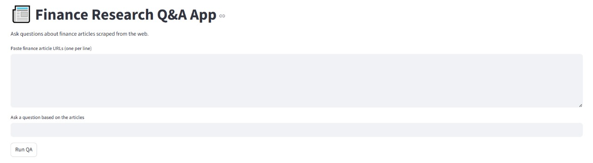
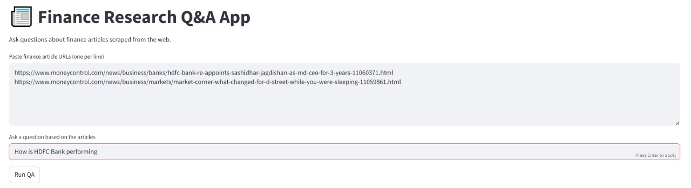
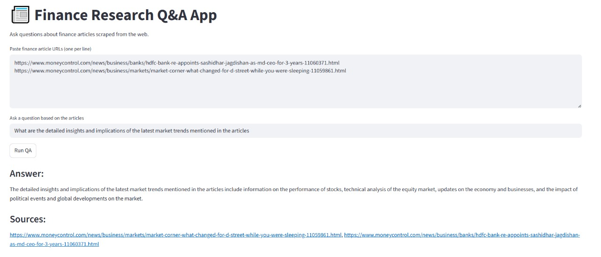

# 📰 Finance Research Q&A App

This is a Streamlit-based application that allows users to extract insights from finance-related articles using OpenAI's LLMs. Simply paste URLs of news articles, ask questions, and get summarized answers with references.

---

## 🔍 Features

- 📎 Paste finance article URLs
- 🤖 Ask any finance-related question
- 🧠 Uses OpenAI LLMs for summarization and Q&A
- 🧾 Displays source references
- 💾 FAISS-based vector store for document retrieval
- 🖼️ Clean Streamlit UI

---

## 📸 Demo

| Home Page | Input Example | Output Example |
|-----------|----------------|----------------|
|  |  |  |


## 🚀 How to Run Locally

### 1. Clone the Repository
```bash
git clone https://github.com/yourusername/equity-research-summarizer.git
cd equity-research-summarizer
2. Create and Activate a Virtual Environment
bash
Copy
Edit
python -m venv venv
venv\Scripts\activate  # On Windows
3. Install Requirements
bash
Copy
Edit
pip install -r requirements.txt
4. Set Up .env File
Create a .env file in the root folder:

dotenv
Copy
Edit
OPENAI_API_KEY=your_openai_api_key_here
5. Run the App
bash
Copy
Edit
streamlit run app/retriever.py
🛠️ Tech Stack
Streamlit for UI

LangChain for LLM orchestration

OpenAI LLMs

FAISS for vector store

Python-dotenv

📄 License
This project is licensed under the MIT License.

🙌 Acknowledgements
MoneyControl for finance articles

LangChain Docs

Streamlit Community

🤝 Connect with Me
Feel free to connect on LinkedIn or follow my work on GitHub.

yaml
Copy
Edit

---

### ✅ Files to Include in Your Repo

| File/Folder         | Purpose                                |
|---------------------|----------------------------------------|
| `README.md`         | Project overview and instructions      |
| `requirements.txt`  | All dependencies                       |
| `.env.example`      | Sample `.env` without the actual key   |
| `app/`              | Streamlit app folder                   |
| `assets/`           | Contains demo screenshots              |
| `scripts/` *(optional)* | Any pre-processing or setup scripts   |
| `vectorstore/`      | (Optional) Saved FAISS index           |

---

Would you like me to generate a `requirements.txt` from your current project too?